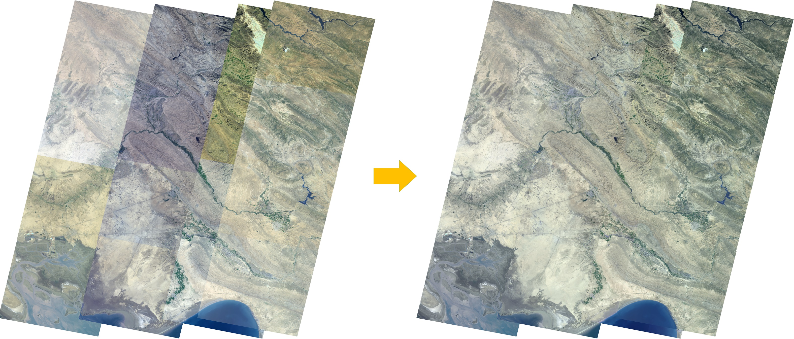

## Introduction

This project is developed for optimizing the color consistency across images and guarantee the imaging
quality of individual image meanwhile. we parameterize the color remapping curve as transform model, 
and express the constraints of color consistency, contrast and gradient in an uniform energy function. It 
can be formulated as a convex quadratic programming problem which provides the global optimal solution efficiently.

This C++ implemented algorithm is described in:  
"[Color Consistency Correction Based on Remapping Optimization for Image Stitching](http://menghanxia.github.io/papers/Color_Consistency_Remapping-ICCVW2017.pdf)", ICCV Workshop 2017.  
"[A Closed-Form Solution for Multi-View Color Correction with Gradient Preservation](http://menghanxia.github.io/2019_Color_Consistency_Optimization_isprs_journal.pdf)", ISPRS Journal 2019 (Extended version).  
This program is free for personal, non-profit and academic use. If you have any question, please contact: menghanxyz@gmail.com (Menghan Xia)

Here is an example for demonstration below:

## Usage
### 1. Dependent Libarary [compulsory]:
OpenCV 2.4.9 is recommended.

### 2. Project Configure:
This procedure is developed on *Visual Studio 2010* under *Windows8.1* system environment,
where the source code is organized with CMakeLists. So, before opening it in Visual Studio,
you need to configure the project with the software named *CMake*.

### 3. Running and Test:
There will be a "*Data*" folder in the decompressing files, where three created folders exist:  
- "*Cache*"  : creat a text file that describes the adjacent relationships of each image. [example contained]
- "*Images*" : input your source images that are aligned geometrically. [example contained]
- "*Results*": procedure will output the processed results in this position. [creat it by yourself]

Besides, to use the existing "*Data*" directory successfully, do not forget to UPDATE the path variable 
'*baseDir*' as **the absolute path** of your directory "*Data*" in the source file "*CoColour/Source/Utils/util.h*" [line 16]

So far, you can run the procedure and see the color correction results now. 